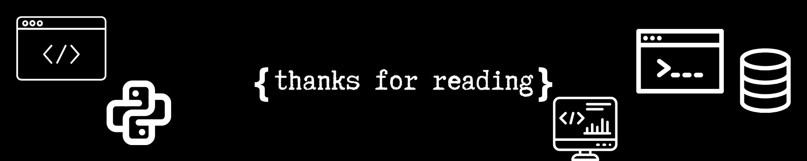

# 👋 im a dutch programmer.

<h2 id="list">📖 Table of contents</h2>
<ul>
  <li><a href="#about">About me</a></li>
  <ul>
    <li><a href="#me">myself</a></li>
    <li><a href="#links">links</a></li>
    <li><a href="#stats">stats</a></li>
  </ul>
  <li><a href="#stack">Tech stack</a></li>
  <ul>
    <li><a href="#SL">languages</a></li>
    <li><a href="#tools">Tools</a></li>
    <li><a href="#sys">Systems</a></li>
  </ul>
  <li><a href="#proj">projects</a></li>
  <li><a href="#misc">misc</a></li>
  <ul>
    <li><a href="#cred">Credits</a></li>
    <li><a href="#sup">Support me</a></li>
  </ul>
</ul>

#

  <h2 id="about"><a href="#list">😊 About me</a></h2>
  <h3 id="me"><a href="#list">🎧 Myself</a></h3>
  <ul>
    <li>Born in 2008</li>
    <li>I love reptiles</li>
    <li>I play baseball</li>
    <li>My favourite food is sushi</li>
    <li>My favourite movie is interstellar</li>
  </ul>
  <h3 id="links"><a href="#list">📎 Links</a></h3>
    
    
  <h3 id="stats"><a href="#list">📊 Stats</a></h3>
    
    
    

#

  <h2 id="stack"><a href="#list">💻 Tech stack</a></h2>
<h3 id="SL"><a href="#list">⌨️ Languages</a></h3>

<!--    -->
  

<h3 id="tools"><a href="#list">💾 Tools</a></h3>

<!--   -->
  

<h3 id="sys"><a href="#list">💽 Systems</a></h3>

  

  <h2 id="proj"><a href="#list">🚀 Projects</a></h2>

#

  <h2 id="misc"><a href="#list">📌 Misc</a></h2>
  <h3 id="cred"><a href="#list">📃 Credits</a></h3>
  <h4>Credit to</h4>
  <ul>
    <li>tandpfun - for the icons <a href="https://github.com/tandpfun/skill-icons#readme">here</a></li>
    <li>anuraghazra - for the stats images <a href="https://github.com/anuraghazra/github-readme-stats">here</a></li>
    <li>aceist - for the inspiration <a href="https://github.com/Aceistt">here</a></li>
  </ul>
  <h3 id="sup"><a href="#list">❤️ Support me</a></h3>
  <h4>You can suport me by</h4>
  <ul>
    <li>Starring anny repository of mine</li>
    <li>Following me on social media</li>
  </ul>

#

<!-- end -->